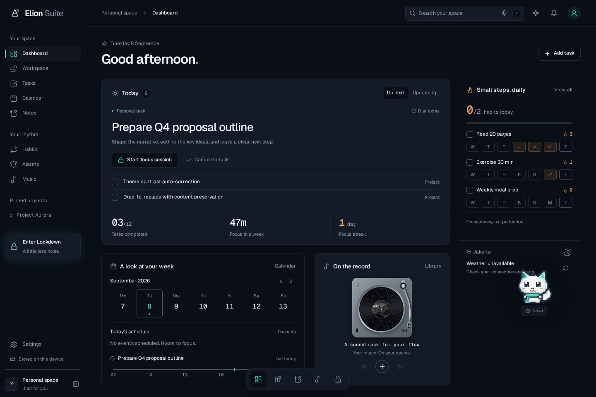
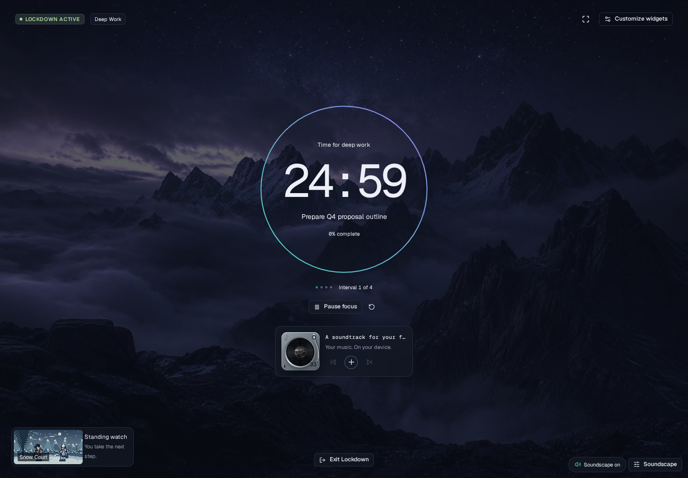
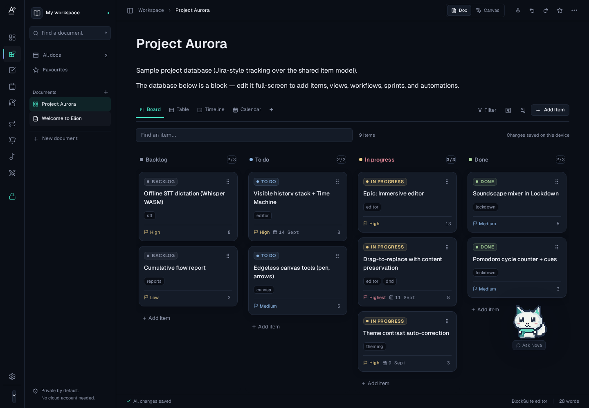
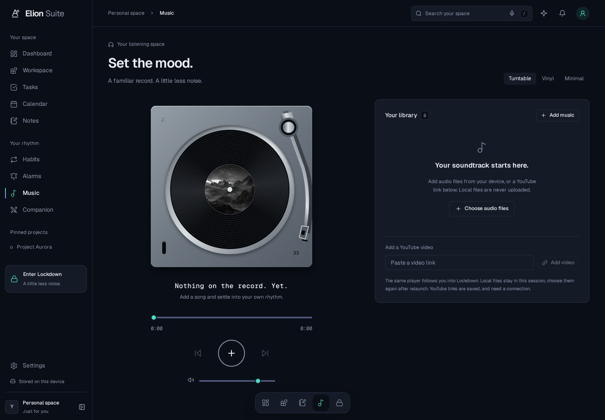
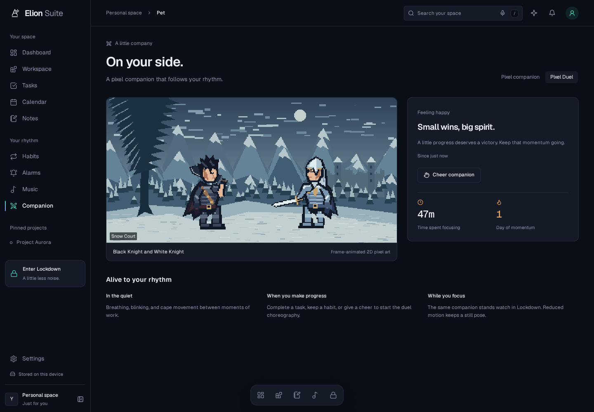

# Elion — premium dark glass

Implementation notes for the supplied Elion visual specification and image references. Updated 8 September 2026.

> **Updated direction:** the later [Studio integration](STUDIO-INTEGRATION.md) adds the actual BlockSuite editor, Nova and selective React Bits glow/motion. It supersedes the old default knight presentation and stricter no-hover-motion rule described in this historical design pass.

## The visual contract

| Token | Value | Use |
|---|---|---|
| Void | `#0A0E16` | Canvas floors and application background |
| Depth | `#141B27` | Panels, cards and controls |
| Hairline | `#232C3D` | One-pixel structure |
| Fog | `#8B93A8` | Secondary text |
| Paper | `#EDEFF6` | Primary text |
| Current | `#45E0C2` | Focus, selection and active controls |
| Dusk | `#9C87F7` | Paired with Current, never a flat UI fill |
| Ember | `#F2A65A` | Habits, streaks and accumulated effort |

The **Premium dark glass** preset is the factory default. `foundation.css` defines typography, spacing, physical-material and motion tokens; `theme.ts` resolves the palette and contrast report. The untouched old Aurora Night preset migrates automatically; customized themes, saved presets and user data are retained.

- Bundled variable **Geist** for words; **Geist Mono** for numbers, code, timers and track readouts. No runtime font-provider request.
- Radius hierarchy: 6px controls/chips, 12px cards, 16px overlays.
- Sunken and default surfaces have no decorative shadow. Raised and overlay levels have distinct directional shadows.
- Glass is `rgba(20, 27, 39, 0.60)` with 20px blur in the default preset. Imported wallpapers receive a luminance-limiting scrim; glass foregrounds are checked against the composited background, not just opaque Depth.
- Density changes spacing rather than shrinking the reading font. Prose stays left-aligned within 76ch; database views can use the available width.
- Semantic colors are independent, contrast-corrected hues. Both subtle and bold Lozenge variants exist.
- UI easing: `cubic-bezier(0.16, 1, 0.3, 1)`. Micro-interactions use 150ms; immersive entry uses 400ms. Mechanical vinyl rotation and discrete sprite frames have separate clocks.

### Signature rationing

The Current–Dusk gradient is confined to the sidebar's 2px active rule, the focus timer ring, and the active/loading dictation microphone. Buttons and card borders never receive it. Lockdown's **transient** entry-edge bloom is the explicit choreography exception; it becomes invisible after entry and stays invisible under reduced motion.

Metal highlights and vinyl grooves are **neutral material illustrations**, not uses of the brand gradient.

## The three archetypes

### Dashboard

The next task is the largest, top-left surface. Its completion and focus actions use the existing item and session stores. Calendar and turntable occupy unequal secondary columns; habits, companion and weather form the narrower rail. Metrics are subordinate to the actual task. Weather is fetched, never invented; the captured screenshot shows its real unavailable state in the sandbox.

### Lockdown

A centered countdown and objective, thin signature ring, small shared music player, and a small companion over a real wallpaper. The default is restrained; **Customize widgets** retains the draggable/resizable free layout. **Restore quiet layout** does not delete the saved widget collection.

The timer is deadline-based and mounted once per session, independent of widget visibility. Pause preserves the remaining time; interval transitions catch up after tab throttling. Exiting saves the session before showing the summary. Per-preset theme overrides restore the previous theme on exit.

### Workspace

A compact page tree, left-aligned document body, full-width database toolbars, and dense board columns. Status changes, filters, WIP limits, view selection, and item dialogs continue to use the original stores. Board handles support pointer and keyboard dragging. The immersive editor keeps its library, inspector, history and snapshot tools.

## The supplied image references

### Physical turntable

The music reference informs a brushed-metal plinth, vinyl grooves, spindle and pivoting tonearm, rather than a flat album-image card. The same `Turntable` renders in Music, Dashboard and Lockdown. Vinyl preserves its rotation angle when paused; the tonearm parks off the record. A real local `<audio>` element and one shared YouTube embed live above the routes.

### Real 2D pixel animation

The two knights are **original low-resolution sprite art**, stylistically informed by the supplied black-swordsman / silver-knight and snowy-duel references. They are not the reference photographs or still PNG cutouts translated across a background.

- 24 transparent source frames per knight, 48 total.
- Authored idle, blink, cape-fold, anticipation, strike, guard, recovery and flourish poses.
- One 12fps clock drives the scene. Snow and the occasional dragon flyby share it.
- One shared pet mood across Dashboard, Lockdown, Pet and the insertable duel block.
- The single pixel knight remains the default `classic` style. Pixel Duel stays opt-in, available directly from Dashboard, Pet and Settings.
- A still pose is used only for reduced motion; background tabs pause the animation clock.
- `scripts/make-pixel-art.py` reproduces the local assets with Python + Pillow. The old static/checkerboard illustrations are no longer shipped.

## Design review

The first Dashboard, Lockdown and board screenshots were reviewed before continuing to the cross-cutting dictation work. The final screenshots above are from the production build, not mockups.

| Check | Result |
|---|---|
| Uniform KPI/card grid | Avoided: task first, unequal secondary surfaces, compact weather |
| Gradient wallpaper/buttons | Avoided: signature restricted to its functional locations |
| Decorative uppercase/monospace | Lozenge alone owns uppercase; mono is used for data/code |
| Per-card entrance / hover lift effects | Removed; one immersive-entry transition |
| Static pet masquerading as animation | Replaced by distinct source sprite frames; browser-tested |
| TaskM inspiration | Its quiet wallpapers and integrated player/companion informed the implementation, without copying its emoji pet |

## Enforced checks

`npm run check:design` checks frontend source for literal UI paint, static pixel lengths outside the foundation (illustration transform origins are exempt), decorative uppercase utility classes, and unpaired Dusk use. Tailwind spacing and radius utilities map to tokens, including opacity-capable color utilities. Dynamic canvas/drag geometry and authored pixel-art coordinates are illustration or domain data, not UI spacing literals.

`tests/theme.test.ts` checks the exact preset, all built-in presets in both modes and several glass strengths, semantic fills, custom seeds, density and import validation.
