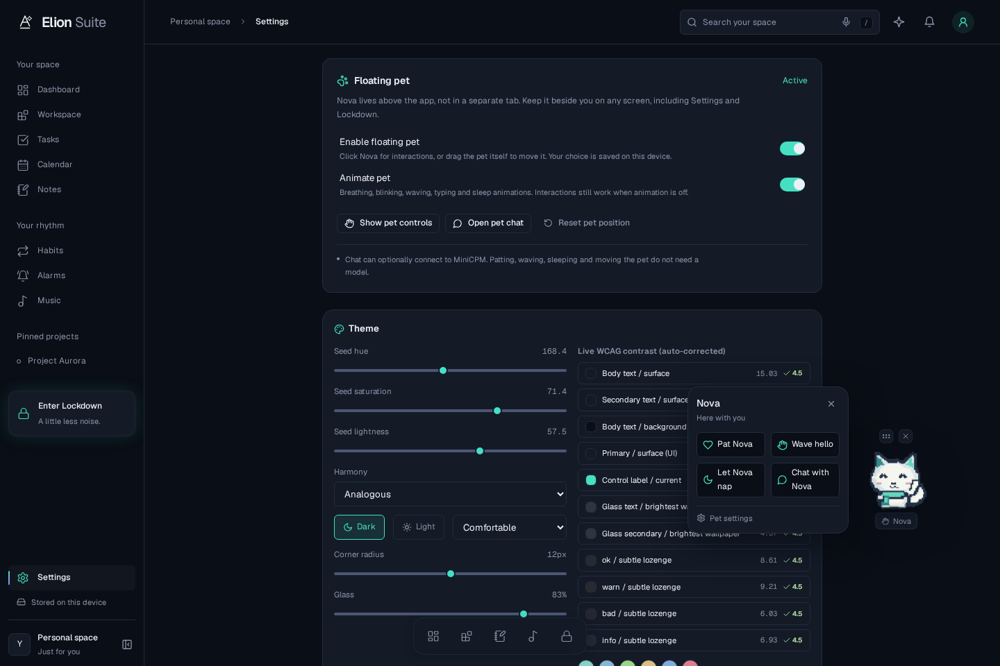

# Floating pet — Settings-controlled, no separate page

Updated to the user's clarification: the companion is a hovering overlay, not a standalone tab or dashboard card.

## Use

1. Open **Settings**. The **Floating pet** section is near the top.
2. Turn **Enable floating pet** on or off. The choice is saved.
3. Leave **Animate pet** on for frame animation and gentle hovering. OS/app reduced-motion preferences take priority.
4. Click Nova (or right-click) to open its small interaction bubble:
   - **Pat Nova**: a happy animation and local feedback.
   - **Wave hello**: an immediate wave.
   - **Let Nova nap / Wake Nova**: sleep and wake poses.
   - **Chat with Nova**: a floating chat bubble, without leaving the current page.
5. Drag the pet itself to reposition it. The grip also supports arrow-key movement. Settings provides **Reset pet position**.

Nova stays available on Dashboard, Workspace, Settings, the other app pages, and Lockdown. Narrow screens use a smaller pet; popovers are clamped to the available viewport. Controls follow the pet's saved location instead of being fixed in an unrelated corner.

There is no Companion sidebar route, pet showcase page, or dashboard pet card. Older `/pet` bookmarks redirect to `/settings#companion`. The image asset directory `/pet/` is unchanged. Old pet-widget records in Lockdown presets are retained but not rendered; the global overlay replaces them. User-authored legacy duel content in documents is not deleted.

## Behavior and privacy

- One global overlay, one shared pet mood, and the existing MiniCPM connector.
- Patting, waving, sleeping and dragging work with no model or network connection.
- Chat still requires the configured local MiniCPM gateway; no disconnected replies are fabricated.
- Disabling the pet closes its controls/chat and aborts an active reply.
- Activation, animation preference and normalized position persist. Temporary reactions, sleep state, open popovers and conversations are not persisted.
- “Floating” means above the Elion app, not a new OS-level always-on-top desktop window.

## Verified

- Production build and design checks pass.
- **89 unit/regression tests** pass.
- **26 browser tests** pass against the production build.
- Checks include Settings activation and persistence, no pet navigation/page, local offline interactions, dragging the actual sprite without accidental clicks, animation preferences, Lockdown visibility, keyboard controls and mobile popup bounds.

[Animation captured while staying in Settings](screenshots/floating-pet.gif)

